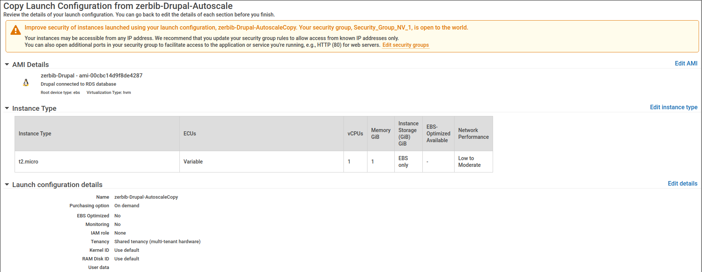
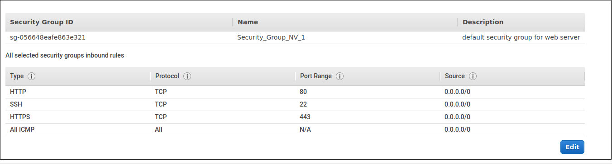
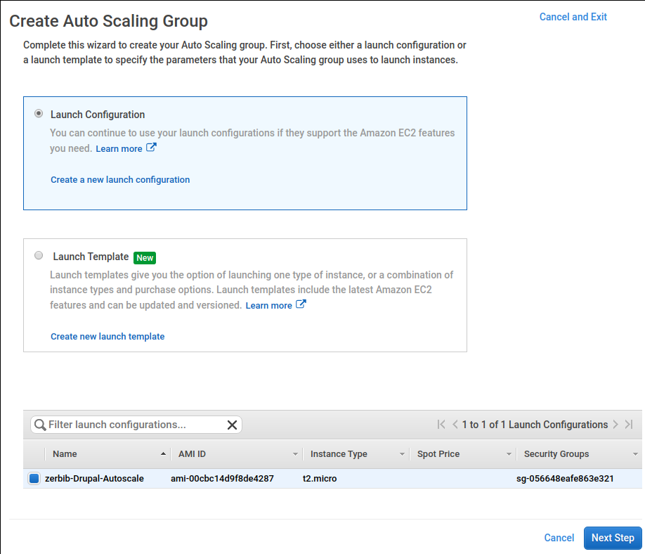
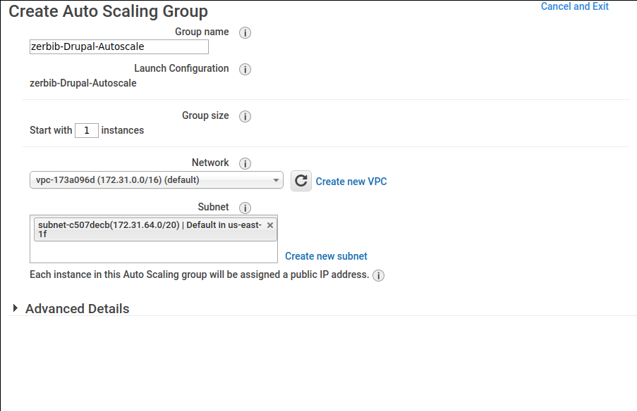
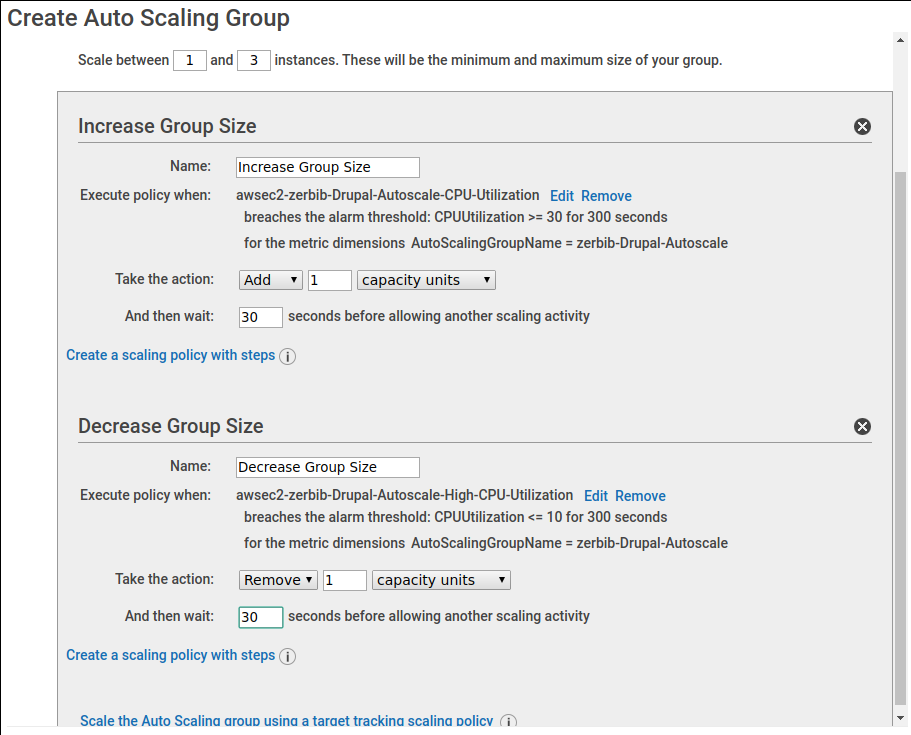
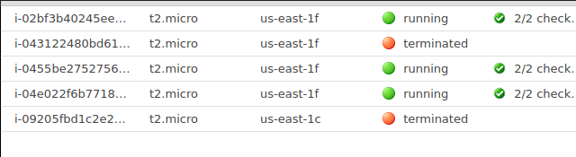
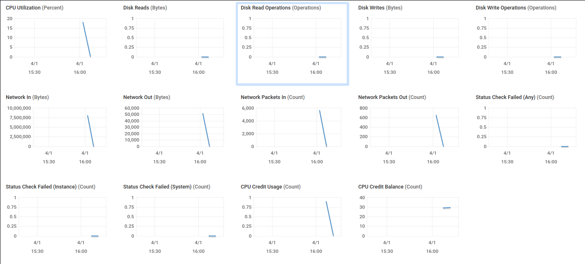
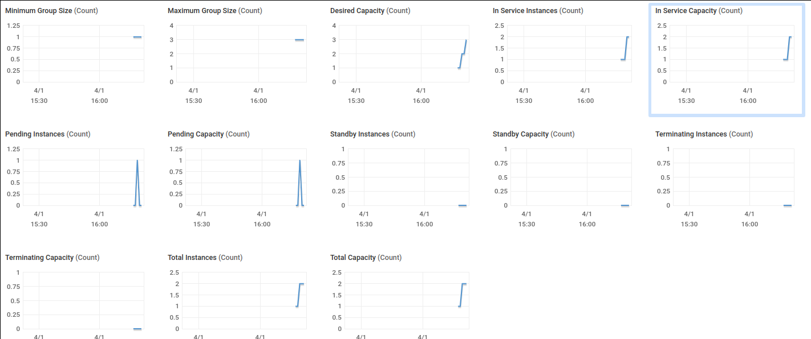
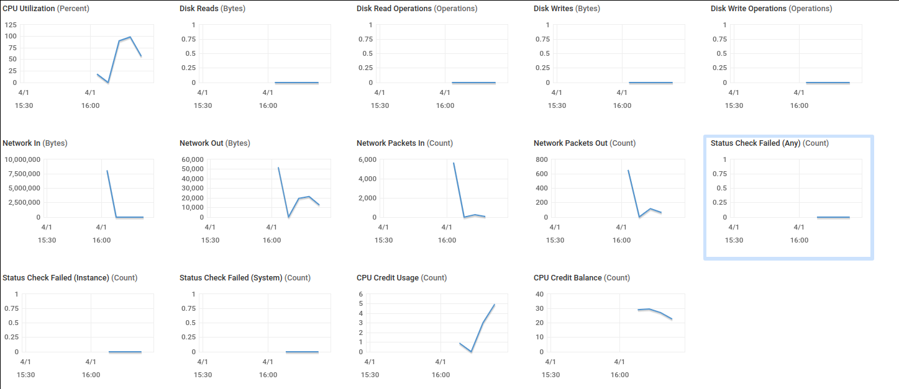
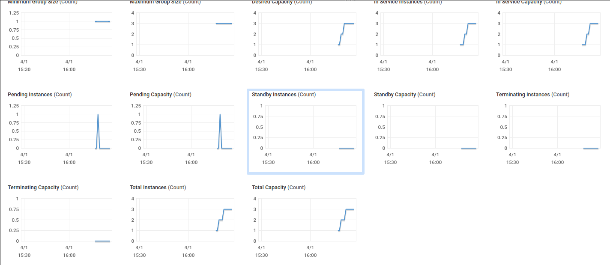

# LAB 03: AUTO SCALING AN APP ON AMAZON WEB SERVICES

## Authors : Jeremy Zerbib, Samuel Mettler

## Date : April, 7th 2020

### TASK 1: ADD AUTO SCALING TO YOUR APPLICATION

In this task you will create an Auto Scaling Group with a scaling policy that automatically launches new instances when the CPU utilization exceeds 30% and terminates instances when CPU utilization falls below 10%.

1. Open the EC2 console. Create a new Launch Configuration based on the AMI you created earlier. Provide the following answers (leave any field not mentioned at its default value):

   - Choose AMI
     - Click on **My AMIs** and choose the AMI created earlier
   - Choose Instance Type
     - Leave at default values
   - Configure detail
     - Name: *yourlastname*-Drupal-Autoscale
   - Configure Security Group
     - Specify the existing security group for Drupal instances

   

   

2. Create a new Auto Scaling Group.

   - Create from existing launch configuration

     - Select the launch configuration you just created

     

   - Configure Auto Scaling group details

     - Group name: *yourlastname*-Drupal-Autoscale
     - Group size: Start with **1** instance
     - Subnet: select one of the available subnets

   

   - Configure scaling policies
     - Use scaling policies to adjust the capacity of this group
     - Scale between **1** and **3** instances.
     - In the **Scale Group Size** box click on **Scale the Auto Scaling group using step or simple scaling policies**.
     - Increase group size: Add new alarm:
       - Send a notification: uncheck
       - Whenever **Average** of **CPU Utilization** is **>= 30** Percent Take the action: **Add 1 Instance**
         Create a simple scaling policy. And then wait **30** seconds before allowing another scaling activity.
     - Decrease group size: Same as before with **CPU Utilization** is **<= 10** Percent.

   

   Observe how the Auto Scaling group launches the first instance.

   We forgot to take a screenshot of this step, but from the screenshot below, you can see that the instance terminated (the second from the top) was the instance created by the auto-scale group.

3. Manually terminate the instance in the Auto Scaling Group. Observe how the Auto Scaling Group automatically replaces it.

   After terminating the instance, as stated in the screenshot below, we can see that the instance is replaced by the auto-scale group

4. Connect the Auto Scaling group to the load balancer. Navigate to **Auto Scaling** > **Auto Scaling Groups**. Select the group. On the **Details** tab, click **Edit**. In the field **Load Balancers**, select your load balancer. Click **Save**.

5. Trigger a scaling action by simulating heavy load. Try to create heavy load with JMeter to trigger a scaling action. If it fails, you can also launch a resource-heavy application on the instance.

   - Log into the instance of the Auto Scaling group.
   - Install package `sysbench`: `sudo apt install sysbench`.
   - Run `sysbench` in a loop: `while true; do sysbench --test=cpu run; done`

6. Bring up two console tabs in your browser.

   - In the first select the instance and in the details view click on **Monitoring**. Click on **Enable Detailed Monitoring**.
   - In the second tab select the Auto Scaling Group and in the details view click on Monitoring.

   Observe how the Auto Scaling Group after some time takes a scaling action to launch a new instance.

   

   *Instances launched by the auto-scale group*

   We can see from the screenshot above that our auto-scale group created three instances. As we configured it to create one to three instances, it is a normal behavior. As CPU usage grows, it creates more and more instances, to a maximum of three.

   

   *Instance*

   

   *Auto-scale group*

   

7. Let the instance sit idle and observe how the Auto Scaling group after some time terminates an instance.

*Instance*

*Auto-scale group*

Deliverables:

- Document your observations of the Auto Scaling Group behavior.